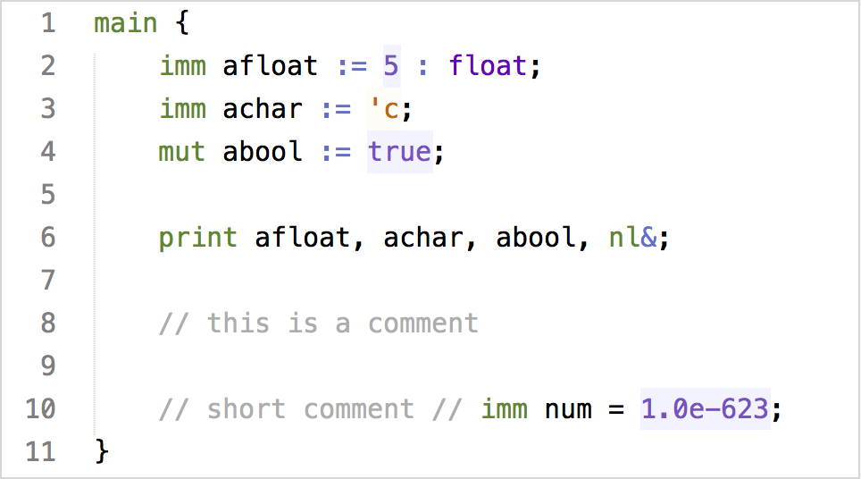

# Bunting Highlight

Syntax highlighting and some small sugar (like comment toggling) for Bunting language and ASM (Abstract Stack Machine). Currently supports Bunting-3. Bunting and ASM are the languages used in [CMPT 379](http://www.cs.sfu.ca/CourseCentral/379/shermer/index.html) by Tom Shermer.

## Installation

For Sublime Text, just [install Package Control](https://packagecontrol.io/installation) and install the Bunting Language package.
